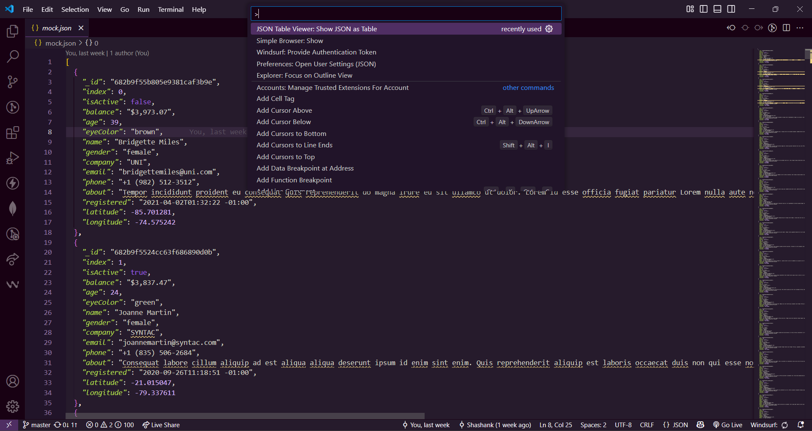
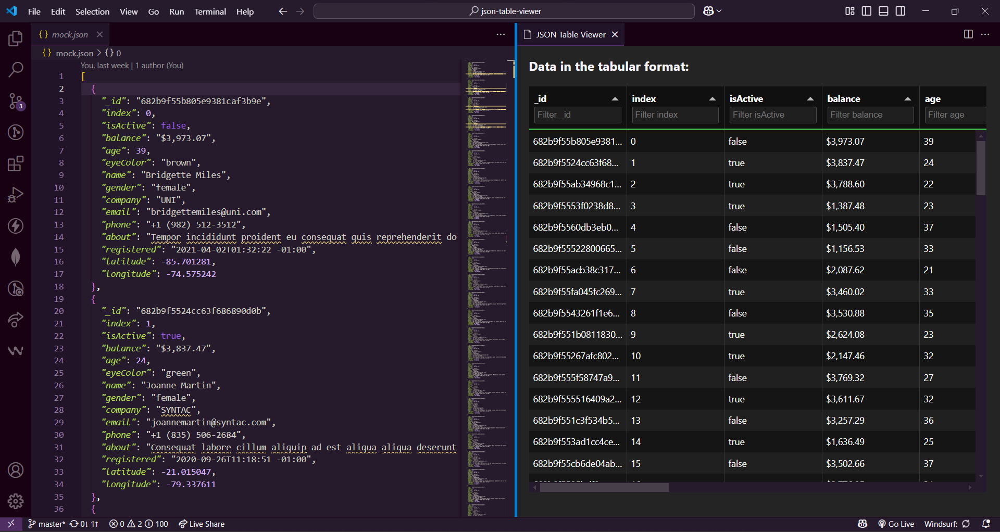

    

# JTableau

# JTableau - JSON Table with Functionality Viewer

> **JTableau** lets you view flat JSON data as an interactive table directly inside Visual Studio Code.

---

## Features

- 📊 **Instant Table View:** Convert JSON files (depth 1) into a sortable, filterable table.
- 🔍 **Column Filtering:** Quickly find data with header filters.
- ↔️ **Resizable Columns:** Adjust column widths to fit your data.
- ⚡ **Fast & Lightweight:** Built with React and Tabulator for performance.
- 🖥️ **Modern UI:** Responsive and user-friendly interface.

---

## Getting Started

1. **Install the Extension:**  
   Search for `JTableau` in the VS Code Extensions Marketplace and install.

2. **Open a JSON File:**  
   Open any `.json` file with flat (depth 1) structure.

3. **Run the Command:**  
   Press `Ctrl+Shift+P` and select `Show JSON as Table` (or right-click in the editor).

4. **Interact with the Table:**  
   - Filter columns using the header filters.
   - Resize columns as needed.
   - Sort by clicking on column headers.

---

## Example

Open a JSON file and run the command `ctrl+shift+p` followed by `Show JSON as Table` to see it displayed as a table.

### Menu Command: `Show JSON as Table`
  
### Resulting Table:
  

---

## Requirements

- Visual Studio Code `v1.100.0` or higher.
- JSON files with a flat (depth 1) structure.

---

## Known Issues

- Only supports flat JSON arrays (depth 1).
- Nested objects/arrays are not displayed in table view.

---

## Contributing

Contributions are welcome! Please open issues or pull requests on [GitHub](https://github.com/orionshub/json-table-viewer).

---

## License

[MIT](./LICENSE)

---

## Credits

- Built with [React](https://react.dev/) and [Tabulator](http://tabulator.info/).
- Extension by [geekyorion](https://github.com/orionshub).

---

Made with ❤️ by the [JTableau Team](https://github.com/orionshub/json-table-viewer/graphs/contributors)
---
